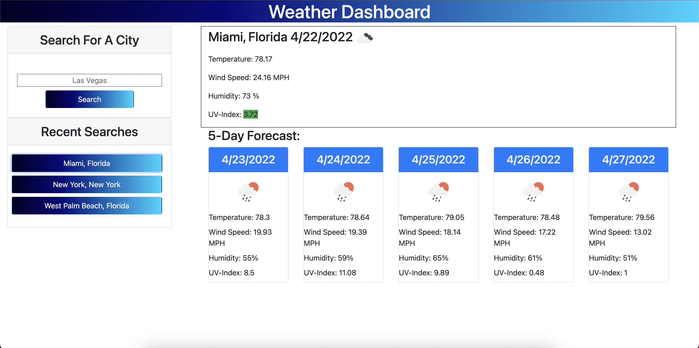

# Weather Dashboard

## Description
This application was designed with the intention of giving the user the opportunity to plan ahead for whatever Mother Nature may want to throw at them. Looking up a city will give the user the forecasted weather for the current day as well as the predicted weather for the following 5 days. All this includes the current temperature, the wind speeds, humidity, and the UV-Index reading for that day. 

## Usage
To use this application, open it up in your browser of choice and in the search bar, simply type in the name of the city you want the weather forecast for. Once you hit search, you'll be presented with the weather forecast, voila! And just in case it's your place of residence or a place you regularly visit, we'll save that search for you just below the search bar for easy access.

## Languages Used
* Javascript
* HTML
* CSS

## Libraries/Frameworks Used
* Bootstrap
* jQuery

## Preview

## Link
https://justjulio95.github.io/weather-dashboard/